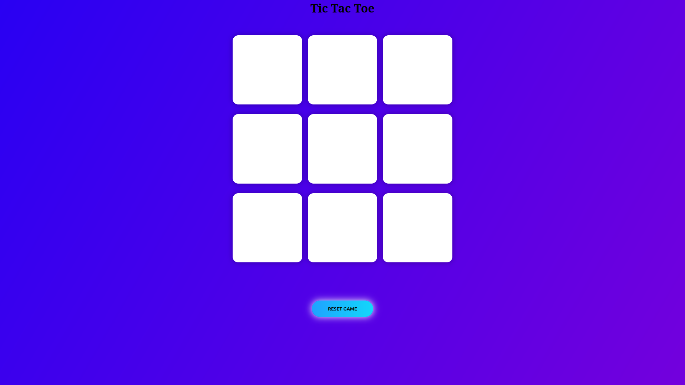
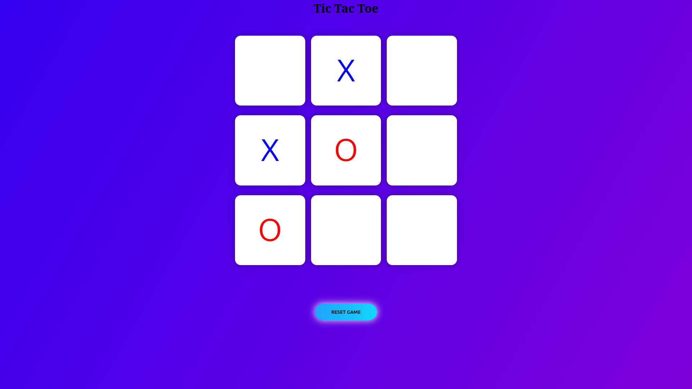
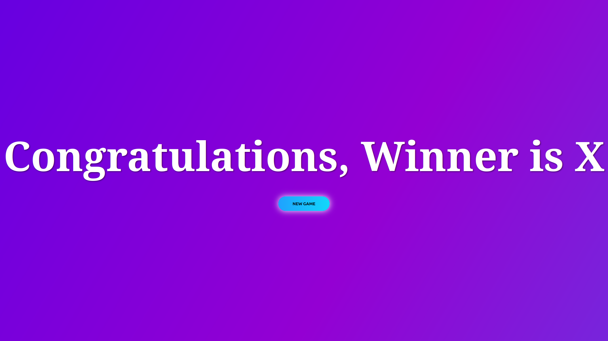
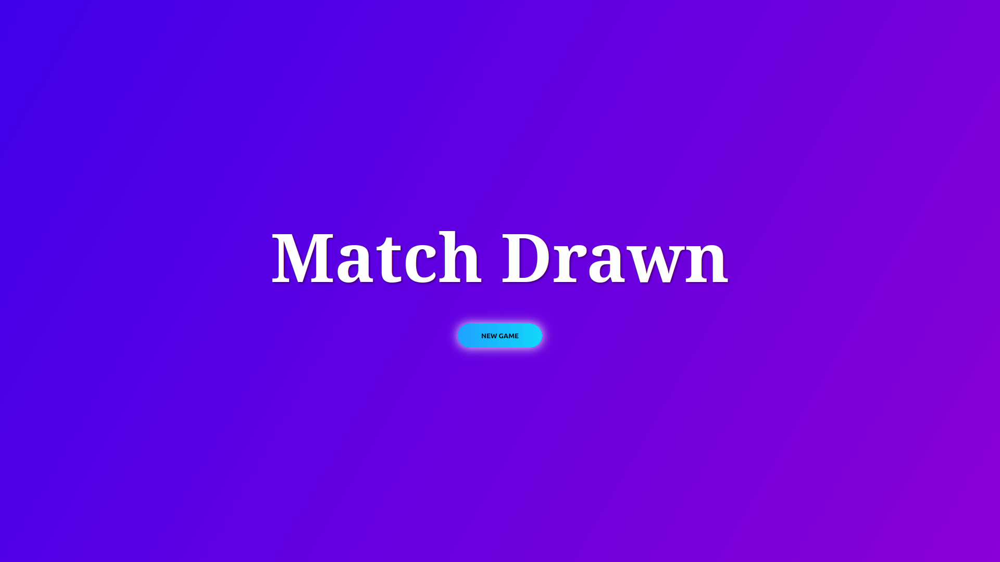

# Tic Tac Toe Game

A modern, interactive Tic Tac Toe game built with HTML, SCSS, CSS, and JavaScript featuring beautiful animations and responsive design.

## 📸 Screenshots

### Main Game Interface

*Clean and modern game interface with animated gradient background*

### Gameplay in Action

*Players X and O taking turns with color-coded marks*

### Winner Announcement

*Stylish popup overlay announcing the game winner*

### Draw Game

*Draw notification when all boxes are filled without a winner*

## 🎮 Game Features

- **Interactive Gameplay**: Classic 3x3 Tic Tac Toe grid
- **Two Player Mode**: Alternating turns between Player O (Red) and Player X (Blue)
- **Win Detection**: Automatic detection of winning patterns
- **Draw Detection**: Handles tie games when all boxes are filled
- **Animated Background**: Beautiful gradient animation with smooth transitions
- **Popup Notifications**: Stylish popup overlay for game results
- **Reset Functionality**: Reset and New Game buttons to restart
- **Responsive Design**: Works on different screen sizes

## 🛠️ Technologies Used

- **HTML5**: Structure and semantic markup
- **SCSS**: Advanced CSS preprocessing for better styling organization
- **CSS3**: Compiled styles with animations and responsive design
- **JavaScript (ES6)**: Game logic, event handling, and DOM manipulation

## 🎨 Design Features

- **Gradient Background**: Animated multi-color gradient background
- **Modern UI**: Clean, minimalist design with rounded corners
- **Hover Effects**: Interactive button and box hover states
- **Box Shadows**: Subtle shadows for depth and visual appeal
- **Smooth Animations**: CSS transitions and keyframe animations
- **Color-coded Players**: Red for O, Blue for X
- **Stylized Buttons**: Gradient buttons with hover effects

## 🚀 How to Play

1. The game starts with Player O's turn
2. Click on any empty box to place your mark
3. Players alternate turns (O → X → O → X...)
4. First player to get 3 marks in a row (horizontal, vertical, or diagonal) wins
5. If all boxes are filled without a winner, it's a draw
6. Use "Reset Game" to clear the board or "New Game" from the popup

## 📁 Project Structure

```
tictactoe/
├── index.html          # Main HTML file
├── script.js           # Game logic and functionality
├── sass/
│   ├── main.scss       # SCSS source file
│   ├── main.css        # Compiled CSS file
│   └── main.css.map    # CSS source map
└── README.md           # Project documentation
```

## 🎯 Game Logic

The game implements the following winning patterns:
- **Rows**: [0,1,2], [3,4,5], [6,7,8]
- **Columns**: [0,3,6], [1,4,7], [2,5,8]
- **Diagonals**: [0,4,8], [2,4,6]

## 🎨 SCSS Features

- **Variables**: Organized color schemes and gradients
- **Nesting**: Hierarchical CSS structure
- **Mixins**: Reusable button styles
- **Animations**: Keyframe animations for background effects

## 🔧 Setup and Installation

1. Clone or download the project files
2. Open `index.html` in your web browser
3. Start playing immediately!

**For SCSS Development:**
```bash
# Install Sass (if not already installed)
npm install -g sass

# Compile SCSS to CSS
sass sass/main.scss sass/main.css

# Watch for changes (optional)
sass --watch sass/main.scss sass/main.css
```

## 📱 Browser Compatibility

- Chrome (recommended)
- Firefox
- Safari
- Edge
- Mobile browsers

## 🎓 Learning Reference

This project was created following the tutorial from **Coding Artist** YouTube channel.

**Tutorial Video**: [Tic Tac Toe Game Tutorial](https://youtu.be/al_AgC2NSCo?si=uhW1m58mhZMgsH2Y)

**Channel**: [Coding Artist](https://www.youtube.com/@CodingArtist)

## 🌟 Key Learning Points

- DOM manipulation with JavaScript
- Event handling and game state management
- SCSS preprocessing and CSS organization
- Responsive design principles
- CSS animations and transitions
- Game logic implementation
- User interface design

## 🔮 Future Enhancements

- [ ] AI opponent mode
- [ ] Score tracking
- [ ] Sound effects
- [ ] Different themes
- [ ] Multiplayer online mode
- [ ] Mobile app version

## 📄 License

This project is open source and available under the [MIT License](LICENSE).

## 🤝 Contributing

Feel free to fork this project and submit pull requests for any improvements!

---

**Enjoy playing Tic Tac Toe!** 🎮✨